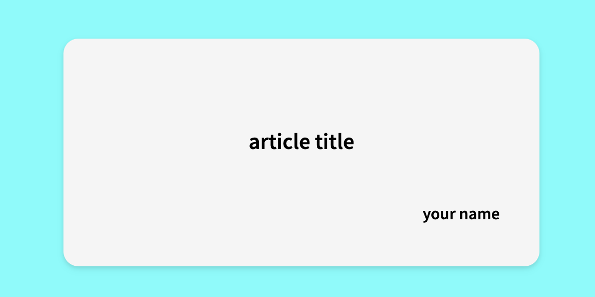

<p align="center">
  
</p>

<p align="center">
Note CLI tool!!
</p>

<p align='center'>
<a href="https://github.com/JY8752/note-cli/releases/latest"></a>
<a href="https://github.com/JY8752/note-cli/releases/latest"></a>
<a href="./LICENSE"></a>
<!-- <a href="https://github.com/JY8752/note-cli/actions/workflows/ci.yml"></a>
<a href="https://codeclimate.com/github/JY8752/note-cli/maintainability"></a> -->
<a href="https://goreportcard.com/report/github.com/JY8752/note-cli"></a>
<a href="https://codecov.io/github/JY8752/note-cli"></a>
</p>

<p align="center">
<a href="./README.md">English</a> | 日本語
</p>

# note-cli

**note-cli**は記事投稿サイトである[note](https://note.com/)の記事作成、管理をサービス上ではなく自分のローカル環境で行うためのCLIツールです。note-cliを作成したモチベーションは以下の通りです。

- webブラウザで開いたエディタではなく自分の好きなエディタで執筆したい。(例えば、VSCode)
- markdown形式で執筆した記事をGitHubなどでバージョン管理したい。
- 記事画像を用意するのがめんどくさい。(noteが用意してくれている無料の画像はあまり使いたくない)

**note-cliはnote以外の記事管理ツールとしても使用できるはずです。例えば、自分で公開しているブログの記事管理などにも使えるでしょう。もし、足りない機能や改善点があればPull Requestまたはissueなどで気軽にお知らせください。**

## note-cliでできること

- 記事をすぐに執筆できるようにmarkdownファイルを含む記事ディレクトリをコマンドで作成します。
- 記事にアップロードするための画像をコマンドで作成することができます。

## インストール

### Go install

```
go install github.com/JY8752/note-cli@latest
```

### Homebrew

```
brew install JY8752/tap/note-cli
```

```
% note-cli -h

note-cli is a CLI command tool for creating, writing, and managing note articles

Usage:
  note-cli [command]

Available Commands:
  completion  Generate the autocompletion script for the specified shell
  create      Create a new article directory.
  help        Help about any command

Flags:
  -h, --help     help for note-cli
  -t, --toggle   Help message for toggle

Use "note-cli [command] --help" for more information about a command.
```

## はじめに

1. 記事を管理するディレクトリを作成し移動します。

```
mkdir note-cli-demo
cd note-cli-demo
```

2. 記事ディレクトリを作成します。

```
% note-cli create article

Create directory. a6b420c6-9bb2-4060-869c-20c171fc9827
Create file. a6b420c6-9bb2-4060-869c-20c171fc9827.md
```

```
.
└── a6b420c6-9bb2-4060-869c-20c171fc9827
    └── a6b420c6-9bb2-4060-869c-20c171fc9827.md
```

- ```a6b420c6-9bb2-4060-869c-20c171fc9827.md``` 記事ファイル。ファイル名はディレクトリ名と同じで今回はランダム値(UUID)を使用しています。
- ~~```config.yaml``` 設定ファイル。記事のタイトルや著者名などを設定するファイルです。~~

```yaml:config.yaml
title: article title
author: your name 
```

**config.yamlは廃止しました。記事タイトルや著者名などの設定情報は記事markdownファイルのメタデータとして記載するように変更されています。**

3. 記事画像を生成する。

以下のコマンドを実行することで```output.png```が生成されます。

```
% note-cli create image

Complete generate OGP image
```



アイコン画像を用意することで画像にアイコンを載せることも可能です。また、テンプレート画像は別の種類を選択することもできます。

```
% note-cli create image -i ./icon.png --template 2
```


4. まとめ

- ```note-cli create article```コマンドで投稿する記事ファイルとディレクトリをコマンドで作成することができます。作成したmarkdownファイルに記事を作成したらコピペしてwebから投稿してください。

- 記事の投稿に必要な画像はOGP画像風にコマンドで作成することができます。このテンプレート画像は他の種類を選択することもできますし、独自でカスタムテンプレートを用意することもできます。

- このようにして、noteの記事を投稿するのに必要な記事ファイルと画像ファイルをコマンドから作成することができ、GitHubなどでバージョン管理をすることが可能です。

## create article

```create article```コマンドを実行するとユニークなランダム値(UUID)を使用してディレクトリを作成します。ディレクトリ内には以下のファイルも併せて作成され配置されます。

- ```<directory name>.md``` 記事ファイル。投稿したい記事の内容をこのファイル内に書き込んでいきます。
- ~~```config.yaml``` 記事や画像ファイルの生成に関する設定をこのファイルで行います。~~

### ~~config.yaml~~

```yaml
title: article title
author: your name
```

| Field | Type | Description |
| --- | --- | --- |
|title|string|生成する画像に載せる記事タイトル|
|author|string|記事執筆者|

### \<directory name>.md

マークダウンファイルは以下のようなメタデータを持ちます。画像の出力には```title```と```author```の項目が使用されます。

```yaml:article.md
---
title: ""
tags: []
date: "2023-09-29"
author: ""
---
```

| Field | Type | Description |
| --- | --- | --- |
|title|string|生成する画像に載せる記事タイトル|
|tags|[]string|記事に紐づけるタグ|
|date|string|ファイル作成日|
|author|string|記事執筆者|

### ```--time(-t)```

このフラグを付けることでデフォルトのUUIDではなく、現在時刻でディレクトリおよびファイルを作成することができます。現在時刻はコマンド実行のOSのタイムゾーンに依存し、```YYYY-mm-dd```のフォーマットで生成されます。

```
% note-cli create article -t    
Create directory. 2023-09-08
Create file. 2023-09-08.md
```

既にディレクトリが存在している場合、```YYYY-mm-dd-{number}```という形式でnumberをインクリメントしてディレクトリを作成します。

```
% note-cli create article -t
Create directory. 2023-09-08-2
Create file. 2023-09-08-2.md
```

### ```--name(-n)```

このフラグを付けることで任意のディレクトリ名で作成することができます。**既に指定の名前でディレクトリが存在する場合はコマンドは失敗します。**

```
% note-cli create article -n article-A
Create directory. article-A
Create file. article-A.md
```

### ```--author(-a)```

このフラグを付けることで記事著者名を事前に渡すことができます。

```
% go run main.go create article -a Yamanaka.J
Create directory. cc4ab85a-2aa7-48a6-8472-3b36ef4778fa
Create file. cc4ab85a-2aa7-48a6-8472-3b36ef4778fa/cc4ab85a-2aa7-48a6-8472-3b36ef4778fa.md

% cat cc4ab85a-2aa7-48a6-8472-3b36ef4778fa/cc4ab85a-2aa7-48a6-8472-3b36ef4778fa.md 
---
title: ""
tags: []
date: "2023-09-29"
author: "Yamanaka.J"
---
```

## create image

```create image```コマンドを実行することで[OGP](https://ogp.me/)画像風の画像を生成することができます。~~画像の生成にはカレントディレクトリに<a href="#configyaml">config.yaml</a>が存在している必要があります。もし、config.yamlが存在していなかった場合はコマンドが失敗します。~~

**config.yamlは廃止となっています。代わりに、markdownファイルのメタデータが存在している必要があります。メタデータを読み取ることができなかった場合、互換性を保つためにconfig.yamlを探し、それでもなければコマンドは失敗します。**

```
% note-cli create image
Complete generate OGP image
```

### ```--icon(-i)```

このフラグの後にicon画像のパスを指定することで画像にアイコンを含めることができます。

```
% note-cli create image -i ./icon.png 
```

### ```--output(-o)```

デフォルトではカレントディレクトリに```output.png```というファイル名で画像は出力されます。出力先を変更したい場合はこのフラグの後にパスを指定することで変更することができます。

```
% note-cli create image -o ./ogp.png 
```

### ```--template```

画像の生成はいくつかのテンプレートとなるHTMLファイルに必要な情報を含めて出力されます。このフラグのあとに```テンプレート番号```を指定することで使用するテンプレートファイルを変更することができます。テンプレートファイルの詳細について[こちら](./docs/templates/templates.md)。(デフォルトでは1番のテンプレートファイルが使用されます。)

```
% note-cli create image --template 2
```

### use custom template file

カレントディレクトリに```template.tmpl```という名前でファイルを配置することで独自に用意したカスタムテンプレートファイルを使用することもできます。テンプレートファイルの形式は[既存のファイル](./internal/run/templates/1.tmpl)を参考にしてください。

テンプレートファイルはGoの```template/html```パッケージを使用しています。テンプレートファイルには以下の変数を使用することができます。

|variable|description|
|--------|-----------|
|{{.Title}}|記事タイトル。この値は<a href="#configyaml">config.yaml</a>で設定した値になります。|
|{{.IconPath}}|アイコン画像。コマンドで指定されていればbase64エンコードされたアイコン画像が値になります。|
|{{.Author}}|著者名。この値は<a href="#configyaml">config.yaml</a>で設定した値になります。|

**もしカスタムのテンプレートファイルを作成したならば、ぜひPull Requestを送ってください。組み込みのテンプレートファイルに追加させていただきたいです。Pull Requestの作成の仕方については[こちら](./docs/templates/templates.md)を参照ください。**