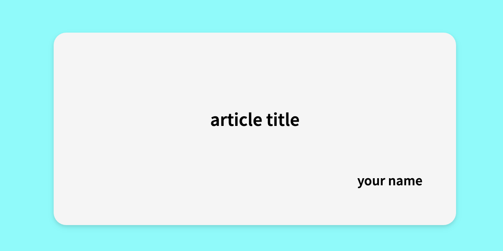
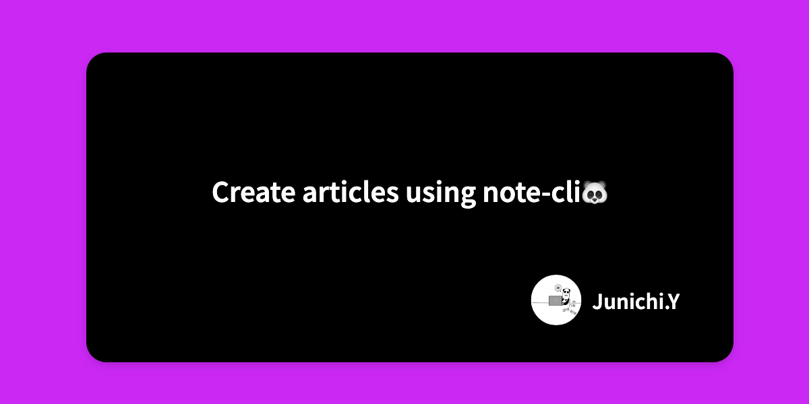

<p align="center">
  
</p>

<p align="center">
Note CLI tool!!
</p>

<p align='center'>
<a href="https://github.com/JY8752/note-cli/releases/latest"></a>
<a href="https://github.com/JY8752/note-cli/releases/latest"></a>
<a href="./LICENSE"></a>
<!-- <a href="https://github.com/JY8752/note-cli/actions/workflows/ci.yml"></a>
<a href="https://codeclimate.com/github/JY8752/note-cli/maintainability"></a> -->
<a href="https://goreportcard.com/report/github.com/JY8752/note-cli"></a>
<a href="https://codecov.io/github/JY8752/note-cli"></a>
</p>

<p align="center">
English | <a href="./README.ja.md">日本語</a>
</p>

# note-cli

**note-cli** is a CLI tool to create and manage articles on [note](https://note.com/), an article submission site, in your local environment instead of on the service. note-cli was created with the following motivation

- I want to write in my preferred editor, not the one opened in my web browser. (For example, VSCode)
- I want to manage the version of articles written in markdown format on GitHub, etc.
- It is troublesome to prepare article images. (I don't want to use the free images provided by NOTE.)

**note-cli should be able to be used as a non-note article management tool. For example, you can use it to manage articles on your own blog. If there are any missing features or improvements, please feel free to let us know via Pull Request or issue.**

## What's note-cli

- Create an article directory containing markdown files with the command so that articles can be written immediately.
- Create images for uploading to articles with the command.

## Install

```
go install github.com/JY8752/note-cli@latest
```

```
% note-cli -h

note-cli is a CLI command tool for creating, writing, and managing note articles

Usage:
  note-cli [command]

Available Commands:
  completion  Generate the autocompletion script for the specified shell
  create      Create a new article directory.
  help        Help about any command

Flags:
  -h, --help     help for note-cli
  -t, --toggle   Help message for toggle

Use "note-cli [command] --help" for more information about a command.
```

## Getting started

1. Create and move to a directory to manage articles.

```
mkdir note-cli-demo
cd note-cli-demo
```

2. Create article directory.

```
% note-cli create article

Create directory. a6b420c6-9bb2-4060-869c-20c171fc9827
Create file. a6b420c6-9bb2-4060-869c-20c171fc9827.md
Create file. config.yaml
```

```
.
└── a6b420c6-9bb2-4060-869c-20c171fc9827
    ├── config.yaml
    └── a6b420c6-9bb2-4060-869c-20c171fc9827.md
```

- ```a6b420c6-9bb2-4060-869c-20c171fc9827.md``` Article file. The file name is the same as the directory name, this time using a random value (UUID).
- ```config.yaml``` Config file. This file is used to set the title of the article, the name of the author, etc.

```yaml:config.yaml
title: article title
author: your name 
```

3. Create article image.

The following command will generate ``output.png``.

```
% note-cli create image

Complete generate OGP image
```



Icons can also be placed on the image by providing an icon image. You can also choose a different type of template image.

```
% note-cli create image -i ./icon.png --template 2
```



4. Summary

- The ``note-cli create article`` command allows you to create article files and directories for posting. Once you have created an article in the created markdown file, copy and paste it and submit it from the web.

- The image required to post an article can be created by command in the style of an OGP image. You can choose other types of this template image or prepare your own custom template.

- In this way, the article and image files needed to post a note article can be created from the command, and version control can be done at GitHub or elsewhere.

## create article

```create article``` command creates a directory with a unique random value (UUID). The following files will also be created and placed in the directory.

- ```<directory name>.md``` Article file.The content of the article you wish to submit will be written in this file.
- ```config.yaml``` This file contains settings related to the generation of articles and image files.

### config.yaml

```yaml
title: article title
author: your name
```

| Field | Type | Description |
| --- | --- | --- |
|title|string|Article Title|
|author|string|Article Author|

### ```--time(-t)```

This flag allows directories and files to be created with the current time instead of the default UUID. The current time depends on the time zone of the operating system under which the command is executed and is generated in the format ``YYYY-mm-dd``.

```
% note-cli create article -t    
Create directory. 2023-09-08
Create file. 2023-09-08.md
Create file. config.yaml
```

If the directory already exists, it creates the directory by incrementing number in the form ``YYYY-mm-dd-{number}``.

```
% note-cli create article -t
Create directory. 2023-09-08-2
Create file. 2023-09-08-2.md
Create file. config.yaml
```

### ```--name(-n)```

This flag allows you to create a directory with an arbitrary name. **If the directory already exists with the specified name, the command will fail.**

```
% note-cli create article -n article-A
Create directory. article-A
Create file. article-A.md
Create file. config.yaml
```

## create image

Image like [OGP](https://ogp.me/) can be generated by executing the ```create image``` command.The <a href="#configyaml">config.yaml</a> must exist in the current directory to generate images.If config.yaml does not exist, the command will fail.

```
% note-cli create image
Complete generate OGP image
```

### ```--icon(-i)```

You can include an icon in an image by specifying the path of the icon image after this flag.

```
% note-cli create image -i ./icon.png 
```

### ```--output(-o)```

By default, images are output to the current directory under the file name ``output.png``. If you wish to change the output destination, you can do so by specifying the path after this flag.

```
% note-cli create image -o ./ogp.png 
```

### ```--template```

The generation of images is output in several template HTML files, including the necessary information. You can change the template file to be used by specifying ``template number`` after this flag. For more information about template files [here](/docs/templates/templates.md). (By default, template file number 1 is used.)

```
% note-cli create image --template 2
```

### use custom template file

You can also use your own custom template files by placing a file named ``template.tmpl`` in the current directory. The format of the template file is [existing file](/internal/run/templates/1.tmpl).

The template file uses ``template/html`` package of Go. The following variables can be used in the template file.

|variable|description|
|--------|-----------|
|{{.Title}}|Article title. This value is set in the <a href="#configyaml">config.yaml</a>.|
|{{.IconPath}}|Icon image. If specified in the command, the value is the base64 encoded icon image.|
|{{.Author}}|Author name. This value is set in the <a href="#configyaml">config.yaml</a>.|

**If you have created a custom template file, please send us a Pull Request so we can add it to the built-in template file. For instructions on how to create a Pull Request, please see [here](./docs/templates/templates.md) for instructions on how to create a Pull Request.**